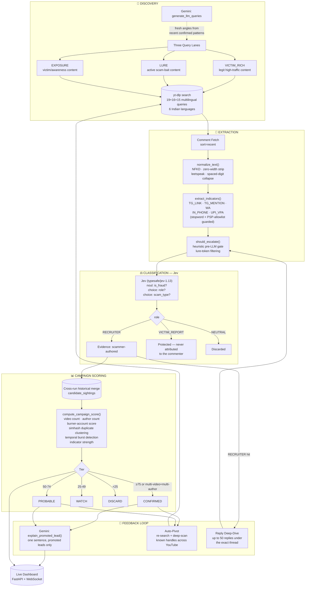

<div align="center">

# 🪝 BaitTrace

### Autonomous Threat-Intelligence Sensor for YouTube Comment-Section Scam Networks

*Scammers don't advertise. They hide in the comments of videos they never made.*

[](https://python.org)
[](https://fastapi.tiangolo.com)
[](https://supabase.com)
[](https://openrouter.ai/docs/guides/community/jev.md)
[](https://ai.google.dev)
[](#testing)

</div>

---

## The Problem

Every day, thousands of Indian YouTube videos — beginner stock-market tutorials, government-job walkthroughs, loan explainers, "how to earn as a student" content — sit underneath comment sections quietly infested with recruiter bots. A fake "trading mentor" drops a WhatsApp number. A sock-puppet account vouches for a Telegram channel promising ₹500/day for "rating tasks." A colour-prediction betting bot links a "proof" screenshot.

Nobody moderates this surface. The videos themselves are completely legitimate. The scam lives entirely in the replies.

**BaitTrace hunts there, continuously, autonomously.**

---

## What Makes This Different

Most scam-detection tooling stops at *"does this one comment look suspicious?"* — a single LLM call, a yes/no answer, done. That approach misses the single strongest signal available: **the same handle, posted by different throwaway accounts, across completely unrelated videos, using near-identical phrasing.** One comment is a coin flip. The same handle on eight videos from eight burner accounts is not.

BaitTrace is built around that insight from the ground up — it doesn't score comments, it builds **campaigns**.

---

## 🧠 The AI Architecture — Two Models, Two Very Different Jobs

Most pipelines bolt one LLM onto everything. BaitTrace deliberately splits cognition across two fundamentally different kinds of models, each doing only what it's actually good at:

### Jev — the classifier (via OpenRouter)

[**Jev**](https://openrouter.ai/docs/guides/community/jev.md) is TypeSafe AI's **System One Model** — not a chat model, a *typed decision engine*. It doesn't generate text. It answers calibrated, structured questions directly:

| Primitive | Used for | Returns |
|---|---|---|
| `noul` | "Is this comment actively recruiting a victim?" | A calibrated probability — not a guess dressed up as confidence |
| `choice` | "Is the commenter a RECRUITER, a VICTIM_REPORT, or NEUTRAL?" | The pick + a native, trained confidence score |
| `choice` | Scam-type classification (TASK_SCAM / RATING_JOB / CRYPTO_BETTING) | Same — typed, bounded, never hallucinated |

Every single classification BaitTrace makes — fraud detection, role attribution, campaign-tier judgment — runs through Jev. It's fast, it's calibrated, and because it structurally *cannot* generate free text, it structurally *cannot* hallucinate an explanation, a quote, or a justification that was never there. That's not a limitation worked around — it's the entire reason it's trustworthy for this job.

### Gemini — reserved for exactly two things

Gemini 3.8 Flash is deliberately *not* the workhorse here. It's kept narrow, on purpose:

1. **Dynamic query generation** — once per sweep, it looks at recently confirmed scam patterns and proposes fresh search angles, because inventing new search phrases is pure text generation — the one thing Jev is architecturally incapable of.
2. **Explaining promoted leads** — once a handle crosses into `PROBABLE`/`CONFIRMED`, and only then, Gemini writes a single human-readable sentence for the dashboard. A tiny fraction of total volume, by design — the free tier never feels the weight of the real workload.

> **Why this split matters:** most of this project's early pain came from treating an LLM's general-purpose rate limit as if it had to absorb every classification in the pipeline. Splitting a *typed-decision* workload onto a *typed-decision* model, and reserving the *generative* workload for a *generative* model, is what actually made this sustainable at scale.

---

## 🏗️ Architecture



---

## 🛡️ Precision-First Design — Why This Doesn't Cry Wolf

A detector nobody trusts is worse than no detector. Every one of these exists because an earlier version got it wrong, caught it, and fixed it for good:

- **Victim-aware classification.** On an exposure video, the person posting a scammer's handle is usually the *victim*, warning others — not the scammer. BaitTrace's `RECRUITER` / `VICTIM_REPORT` / `NEUTRAL` split means a victim's warning is never mistaken for a confession.
- **Videos are never accused — handles are.** The evidence ledger shows "Sighted On," never "Scam Video." A legitimate stock-market tutorial with a recruiter comment underneath stays a legitimate video.
- **Fail-closed, always.** If the classifier is unreachable, nothing gets manufactured as fraud. Every sighting carries an explicit `llm_status`: `EVALUATED`, `PENDING_RETRY`, or `FAILED_PARSE` — an outage produces *silence*, never a false accusation, and `PENDING_RETRY` evidence gets automatically re-queued the moment the classifier is back.
- **Regex with teeth, not vibes.** Telegram-handle extraction uses word-boundary lookarounds and a stopword rejection list — "telephone," "television," and "MTG option" cannot match. UPI extraction requires a real PSP-suffix allowlist (`oksbi`, `ybl`, `paytm`...) — `support@mycompany` cannot match.
- **No single comment can confirm a campaign.** `compute_campaign_score()` hard-blocks `CONFIRMED` tier unless there are at least 2 distinct videos **and** 2 distinct authors. One comment, however alarming, is capped at `PROBABLE` — evidence, not a verdict.
- **Schema-contract tests.** A dedicated regression suite diffs every field the pipeline writes against the live database schema, specifically so a silently-failing write (the single most expensive bug class this project hit, twice) can never happen again unnoticed.

---

## ✨ Feature Breakdown

| System | What it does |
|---|---|
| 🌐 **Multilingual Discovery** | 50+ queries across three intent lanes, in English, Hindi, Bengali, Malayalam, Telugu, Tamil, and Kannada |
| 🤖 **LLM-Generated Query Expansion** | Gemini proposes new search angles each sweep based on recently confirmed scam patterns — the query set gets smarter as the sensor runs |
| 🧼 **De-obfuscation Engine** | Defeats zero-width spaces, leetspeak (`te1egram`), spaced-out digits, and NFKD-level unicode tricks before extraction ever runs |
| ⚖️ **Jev-Powered Triage** | Calibrated, structured, hallucination-resistant classification at the comment level |
| 🕸️ **Campaign Graph Scoring** | Weighted evidence model: video spread, author spread, burner-account heuristics, simhash near-duplicate clustering, temporal burst detection |
| 🔁 **Cross-Run Historical Merge** | A handle seen once today and again next week gets combined into one evolving campaign score — evidence compounds instead of resetting |
| 🎯 **Auto-Pivot** | Once a handle clears a threat threshold, BaitTrace automatically re-searches YouTube for it and deep-scans every video where it reappears |
| 🧵 **Reply Thread Deep-Dive** | A confirmed recruiter comment triggers a full reply-thread fetch — sock-puppet vouching replies are exactly what gets missed otherwise |
| 🕵️ **Author Cross-Referencing** | Burner-account authors get pivoted on by display name/channel, cross-checked against their own upload history |
| ⏱️ **Continuous Scheduler** | Dashboard-controlled sweep interval, graceful shutdown, automatic `PENDING_RETRY` backlog clearing before every sweep |
| 📡 **Live Observability Dashboard** | Real-time WebSocket log stream, campaign threat ledger, and a staged-evidence view into everything still under evaluation |

---

## 🗄️ Data Model

Three tables, deliberately separated by what they represent:

| Table | Represents |
|---|---|
| `candidate_sightings` | **Every** indicator that survived extraction — the full, honest evidence log, fraud or not |
| `handles` | One row per unique handle ever sighted — the watchlist, always upserted regardless of tier |
| `actionable_leads` | Only `PROBABLE`/`CONFIRMED` — the output that's actually worth a human's attention |

---

## 🧰 Tech Stack

| Layer | Technology |
|---|---|
| Ingestion | `yt-dlp`, `youtube-comment-downloader` |
| Classification | **Jev** (`typesafe/jev-1.13` via OpenRouter) |
| Query Generation & Lead Explanation | **Gemini 3.8 Flash** |
| Database | Supabase (Postgres) |
| Backend / Dashboard | FastAPI + WebSocket |
| Language | Python 3.10+ |

---

## 🚀 Getting Started

```bash
git clone <repo-url>
cd baittrace
pip install -e .

cp .env.example .env
# fill in SUPABASE_URL, SUPABASE_KEY, GEMINI_API_KEY, OPENROUTER_API_KEY

# apply schema.sql to your Supabase project, then:
python -m baittrace.main --once --limit 5 --max-comments 35

# or run the live dashboard:
python -m baittrace.server
```

### Testing

```bash
python -m pytest tests/ -v
```

---

<div align="center">

**BaitTrace doesn't wait for a victim to complain. It finds the lure before someone bites.**

</div>
